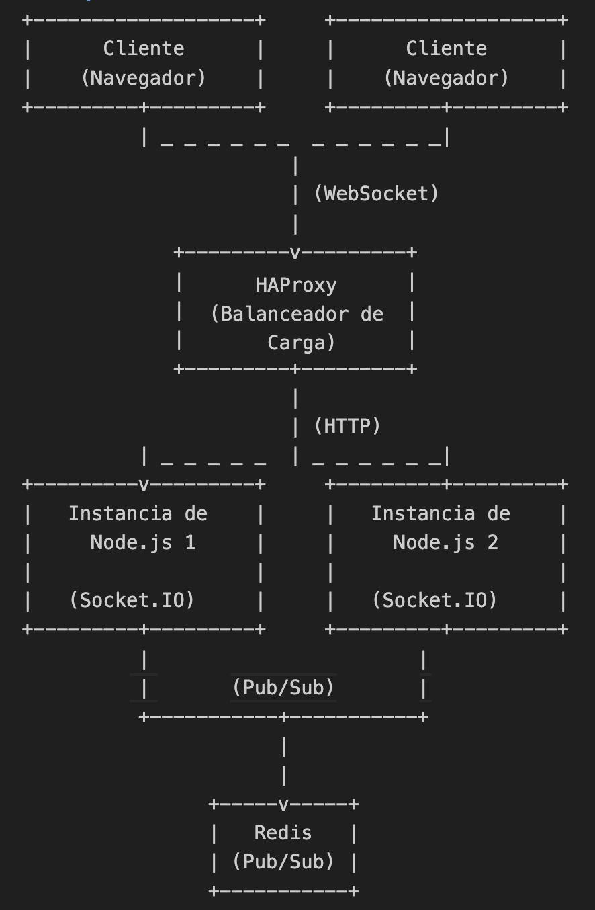

# Proyecto de Chat en Tiempo Real con Node.js y Socket.IO

## Descripción

Este proyecto es una aplicación de chat en tiempo real construida con **Node.js** y **Socket.IO**. Utiliza **Redis** como un sistema de mensajería pub/sub para permitir la escalabilidad y la persistencia de las conexiones. Además, se utiliza **Docker** para facilitar la implementación y la gestión de containers, y **HAProxy** como un balanceador de carga para distribuir el tráfico entre múltiples instancias de la aplicación. La aplicación está diseñada para manejar múltiples usuarios conectados simultáneamente.

## Tecnologías Utilizadas

- **Node.js**: Entorno de ejecución para JavaScript del lado del servidor.
- **Express**: Framework web para Node.js que simplifica la creación de servidores.
- **Socket.IO**: Libreria que permite la comunicación en tiempo real entre el cliente y el servidor.
- **Redis**: DB en memoria que se utiliza como un sistema de mensajería pub/sub que permite la comunicación entre instancias del servidor.
- **socket.io-redis**: Adapter para integrar Redis como un broker de mensajes para Socket.IO.
- **Docker**: Plataforma para desarrollar y ejecutar aplicaciones en containers.
- **HAProxy**: Balanceador de carga que distribuye el tráfico entre múltiples instancias de la aplicación.

## Propósito del Proyecto

El objetivo de este proyecto es crear una plataforma de chat en tiempo real que permita a diferentes usuarios comunicarse. La arquitectura elegida permite que la aplicación pueda escalar horizontalmente, lo que significa que puede manejar un número creciente de usuarios y conexiones sin afectar el rendimiento.

## Características

- Chat en tiempo real entre usuarios.
- Escalabilidad mediante la utilización de Redis.
- Conexiones persistentes.
- Implementación mediante Docker.
- Balance de carga con HAProxy para gestionar múltiples instancias.

## Arquitectura
 

## Instalación y Ejecución

### Requisitos Previos

Tener Docker y Docker Compose instalados en su sistema. Puede seguir las instrucciones en la [documentación oficial de Docker](https://docs.docker.com/get-docker/) para la instalación.

### Clonar el Repositorio

1. Clonar este repositorio:
   ```bash
   git clone git@github.com:joseidmdev/socket_reids.git
